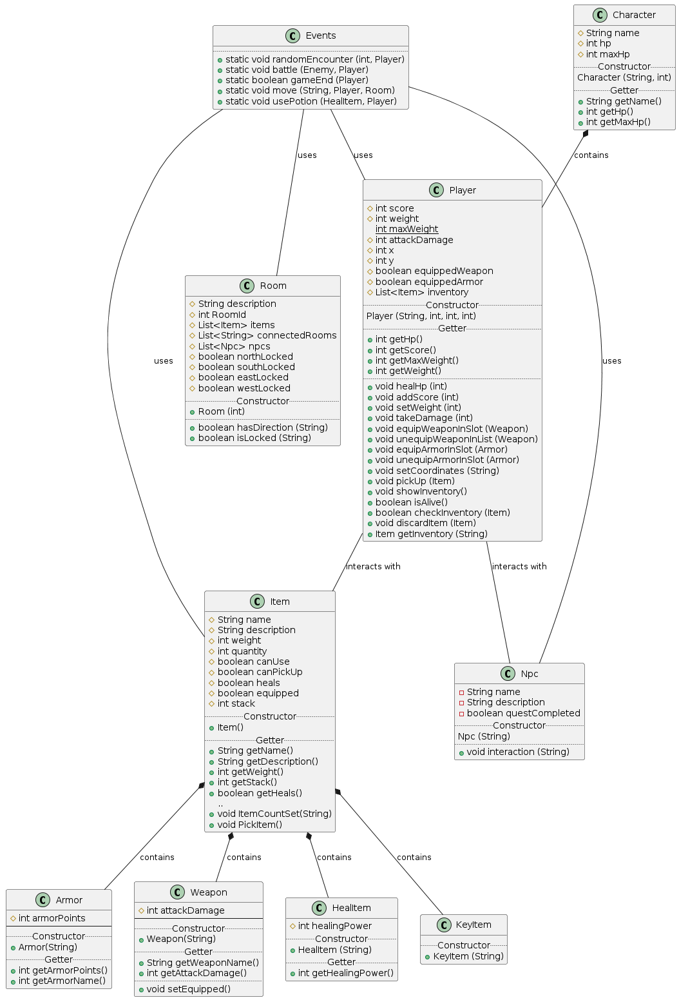
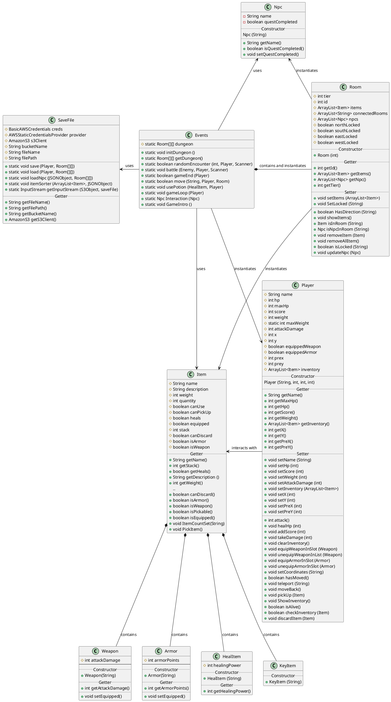

# Class Diagram

```plantuml
@startuml
class Weapon {
  #int attackDamage
  --
  .. Constructor ..
  + Weapon(String)
  .. Getter ..
  + int getAttackDamage()
  ..
  + void setEquipped()
}

class Armor {
  #int armorPoints
  --
  .. Constructor ..
  + Armor(String)
  .. Getter ..
  + int getArmorPoints()
  ..
  + void setEquipped()
}

class Item {
  #String name
  #String description
  #int weight
  #int quantity
  #boolean canUse
  #boolean canPickUp
  #boolean heals
  #boolean equipped
  #int stack
  #boolean canDiscard
  #boolean isArmor
  #boolean isWeapon
  .. Getter ..
  + String getName()
  + int getStack()
  + boolean getHeals()
  + String getDescription ()
  + int getWeight()
  .. 
  + boolean canDiscard()
  + boolean isArmor()
  + boolean isWeapon()
  + boolean isPickable()
  + boolean isEquipped()
  + void ItemCountSet(String)
  + void PickItem()
}

class HealItem {
  #int healingPower
  ..Constructor..
  + HealItem (String)
  ..Getter..
  + int getHealingPower()
}

class KeyItem {
  ..Constructor..
  + KeyItem (String)
}

class Room {
  #int tier
  #int id
  #ArrayList<Item> items
  #ArrayList<String> connectedRooms
  #ArrayList<Npc> npcs
  #boolean northLocked
  #boolean southLocked
  #boolean eastLocked
  #boolean westLocked
  ..Constructor..
  + Room (int)
  ..Getter..
  + int getId()
  + ArrayList<Item> getItems()
  + ArrayList<Npc> getNpc()
  + int getTier()
  ..Setter..
  + void setItems (ArrayList<Item>)
  + void SetLocked (String)
  ..
  + boolean HasDirection (String)
  + void showItems()
  + Item isInRoom (String)
  + Npc isNpcInRoom (String)
  + void removeItem (Item)
  + void removeAllItem()
  + boolean isLocked (String)
  + void updateNpc (Npc)
}

class Player {
  #String name
  #int hp
  #int maxHp
  #int score
  #int weight
  #static int maxWeight
  #int attackDamage
  #int x
  #int y
  #boolean equippedWeapon
  #boolean equippedArmor
  #int prex
  #int prey
  #ArrayList<Item> inventory
  ..Constructor..
  Player (String, int, int, int)
  ..Getter..
  + String getName()
  + int getMaxHp()
  + int getHp()
  + int getScore()
  + int getWeight()
  + ArrayList<Item> getInventory()
  + int getX()
  + int getY()
  + int getPreX()
  + int getPreY()
  ..Setter..
  + void setName (String)
  + void setHp (int)
  + void setScore (int)
  + void setWeight (int)
  + void setAttackDamage (int)
  + void setInventory (ArrayList<Item>)
  + void setX (int)
  + void setY (int)
  + void setPreX (int)
  + void setPreY (int)
  ..
  + int attack()
  + void healHp (int)
  + void addScore (int)
  + void takeDamage (int)
  + void clearInventory()
  + void equipWeaponInSlot (Weapon)
  + void unequipWeaponInList (Weapon)
  + void equipArmorInSlot (Armor)
  + void unequipArmorInSlot (Armor)
  + void setCoordinates (String)
  + boolean hasMoved()
  + void teleport (String)
  + void moveBack()
  + void pickUp (Item)
  + void ShowInventory()
  + boolean isAlive()
  + boolean checkInventory (Item)
  + void discardItem (Item)
}

class Npc {
  -String name
  -boolean questCompleted
  ..Constructor..
  Npc (String)
  ..
  + String getName()
  + boolean isQuestCompleted()
  + void setQuestCompleted()
}

class Events {
  # static Room[][] dungeon
  ..
  + static void initDungeon () 
  + static Room[][] getDungeon()
  + static boolean randomEncounter (int, Player, Scanner)
  + static void battle (Enemy, Player, Scanner)
  + static boolean gameEnd (Player)
  + static boolean move (String, Player, Room)
  + static void usePotion (HealItem, Player)
  + static void gameLoop (Player)
  + static Npc Interaction (Npc)
  + static void GameIntro ()
}

class SaveFile {
  # BasicAWSCredentials creds
  # AWSStaticCredentialsProvider provider
  # AmazonS3 s3Client
  # String bucketName
  # String fileName
  # String filePath
  ..
  + static void save (Player, Room[][])
  + static void load (Player, Room[][])
  + static void loadNpc (JSONObject, Room[][])
  + static void itemSorter (ArrayList<Item>, JSONObject)
  + static InputStream getInputStream (S3Object, saveFile)
  ..Getter..
  + String getFileName()
  + String getFilePath()
  + String getBucketName()
  + AmazonS3 getS3Client()
}

Item *-- HealItem: contains
Item *-- KeyItem: contains
Item *-- Weapon: contains
Item *-- Armor: contains


Player -left-> Item : interacts with
Events --> Player : instantiates
Events *-right- Room : contains and instantiates
Events -up-> Npc : uses
Events --> Item : uses
Room -up-> Npc: instantiates
Room --> Item: instantiates
Events -left-> SaveFile: uses
@enduml
```
