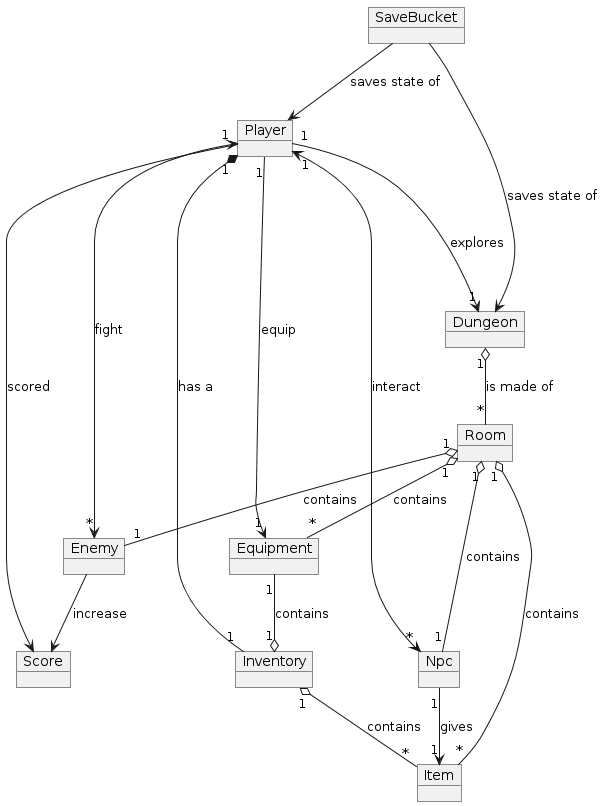
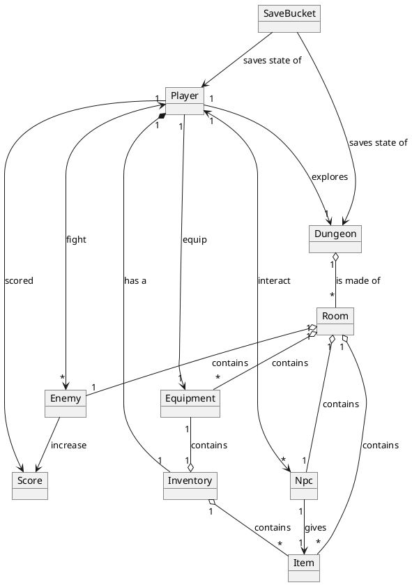

# Domain Model

```plantuml
@startuml
object Room
object Player
object Item
object Equipment
object Enemy
object Npc
object Inventory
object Score
object Dungeon
object SaveBucket
Player "1" <--> "*" Enemy  : fight
Player "1" *-- "1" Inventory : has a
Player "1" <---> "*" Npc : interact
Player "1" --> "1" Equipment : equip
Player "1" ---> "1" Dungeon : explores
Room "1" o--- "1" Npc : contains
Room "1" o-- "1" Enemy : contains
Inventory "1" o-- "*" Item : contains
Npc "1" --> "1" Item: gives
Equipment "1" --o "1" Inventory: contains
Enemy --> Score: increase
Player --> Score : scored
Dungeon "1" o-- "*" Room : is made of
Room "1" o-- "*" Item : contains
Room "1" o-- "*" Equipment : contains
SaveBucket --> Dungeon : saves state of
SaveBucket --> Player : saves state of
@enduml
```
