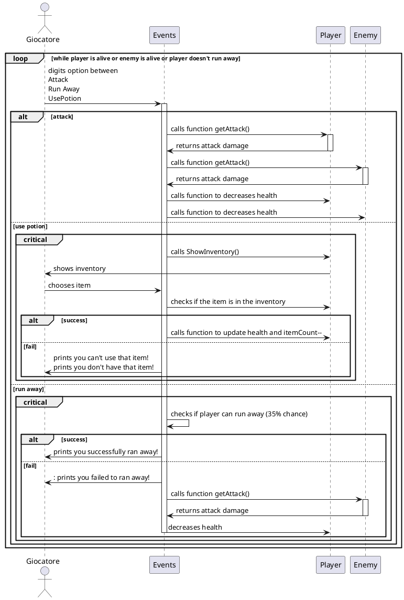
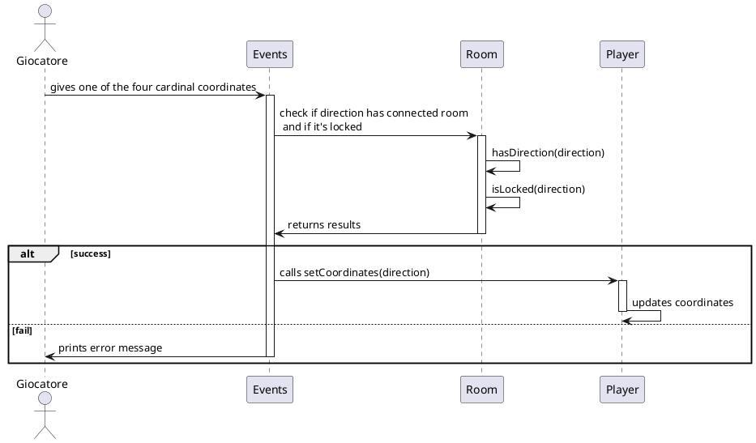
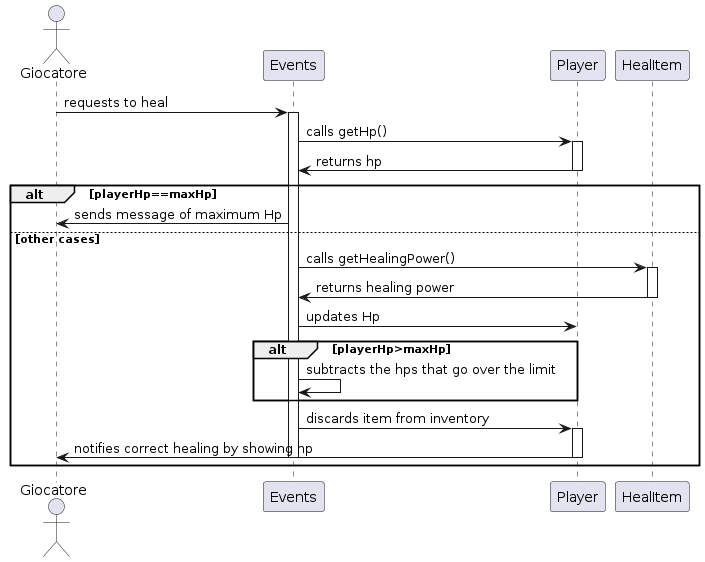
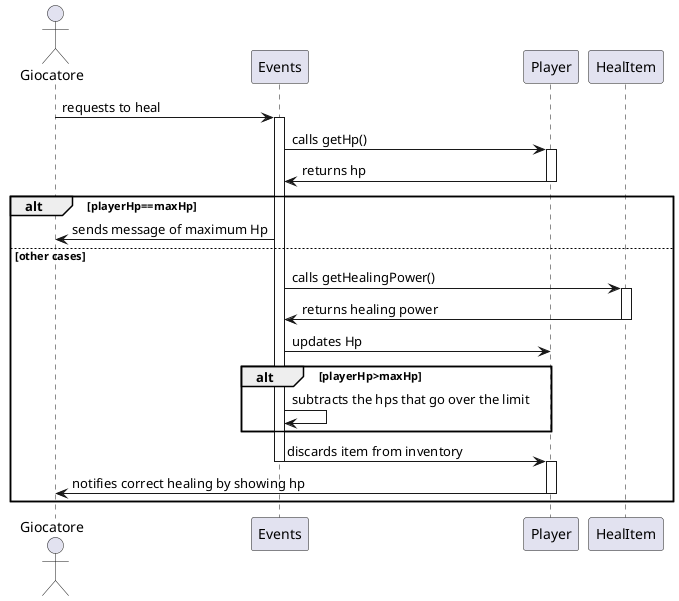
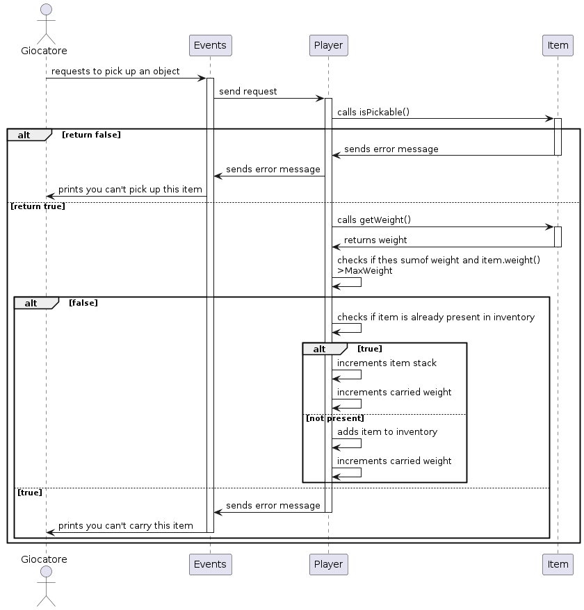
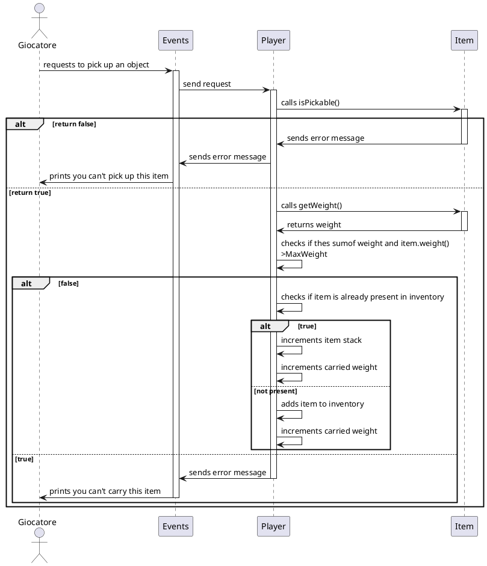
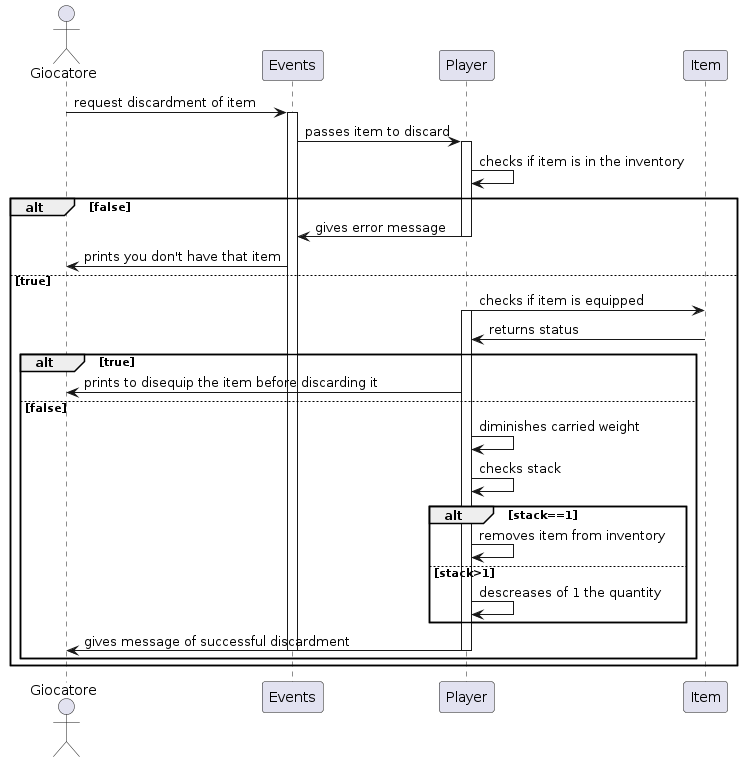
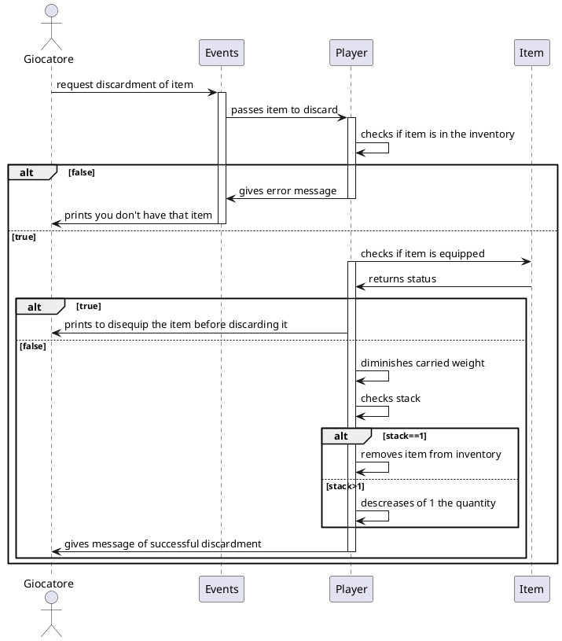

# Internal Sequence Diagrams
## Combat

```plantuml
@startuml
actor Giocatore
participant Events
participant Player
participant Enemy

loop while player is alive or enemy is alive or player doesn't run away
Giocatore->Events: digits option between\nAttack\nRun Away\nUsePotion
activate Events
alt attack
Events-> Player: calls function getAttack()
activate Player
Player->Events: returns attack damage
deactivate Player
Events-> Enemy: calls function getAttack()
activate Enemy
Enemy->Events: returns attack damage
deactivate Enemy
Events -> Player: calls function to decreases health
Events-> Enemy: calls function to decreases health
else use potion
critical
Events->Player: calls ShowInventory()
Player->Giocatore: shows inventory
Giocatore->Events: chooses item
Events->Player: checks if the item is in the inventory
alt success
Events->Player: calls function to update health and itemCount--
else fail
Events->Giocatore: prints you can't use that item!\nprints you don't have that item!
end
end
else run away
critical
Events->Events:checks if player can run away (35% chance)
alt success
Events->Giocatore: prints you successfully ran away!
else fail
Events->Giocatore:: prints you failed to ran away!
Events-> Enemy: calls function getAttack()
activate Enemy
Enemy->Events: returns attack damage
deactivate Enemy
Events-> Player: decreases health
deactivate Events
end
end
end
end
@enduml
```
## Move

```plantuml
@startuml
actor Giocatore
participant Events
participant Room

Giocatore -> Events: gives one of the four cardinal coordinates 
activate Events
Events-> Room: check if direction has connected room\n and if it's locked
activate Room
Room -> Room: hasDirection(direction)
Room -> Room : isLocked(direction)
Room -> Events: returns results
deactivate Room


alt success
Events-> Player: calls setCoordinates(direction)
activate Player
Player-> Player: updates coordinates
deactivate Player

else fail
Events-> Giocatore: prints error message
deactivate Events
end
@enduml
```

## usePotion

```plantuml
@startuml
actor Giocatore
participant Events
participant Player
participant HealItem

Giocatore -> Events: requests to heal
activate Events
Events -> Player: calls getHp()
activate Player
Player -> Events: returns hp
deactivate Player
alt playerHp==maxHp
Events -> Giocatore: sends message of maximum Hp
else other cases
Events -> HealItem: calls getHealingPower()
activate HealItem
HealItem->Events: returns healing power
deactivate HealItem
Events -> Player: updates Hp
alt playerHp>maxHp
Events -> Events: subtracts the hps that go over the limit
end

Events -> Player: discards item from inventory
deactivate Events
activate Player
Player -> Giocatore: notifies correct healing by showing hp
deactivate Player
end
@enduml
```

## PickUp

```plantuml
@startuml
actor Giocatore
participant Events
participant Player
participant Item

Giocatore -> Events: requests to pick up an object
activate Events
Events -> Player: send request
activate Player
Player -> Item: calls isPickable()
Activate Item
alt return false
Item -> Player: sends error message
deactivate Item
Player-> Events: sends error message

Events->Giocatore: prints you can't pick up this item
else return true
Player -> Item: calls getWeight()
activate Item
Item -> Player: returns weight
deactivate Item 
Player-> Player: checks if thes sumof weight and item.weight() \n>MaxWeight

alt false
Player-> Player: checks if item is already present in inventory
alt true
Player-> Player: increments item stack
Player-> Player: increments carried weight
else not present
Player-> Player: adds item to inventory
Player-> Player: increments carried weight
end

else true
Player-> Events: sends error message
deactivate Player
Events-> Giocatore: prints you can't carry this item
deactivate Events

end
end
@enduml
```

## Discard

```plantuml
@startuml
actor Giocatore
participant Events
participant Player
participant Item

Giocatore -> Events: request discardment of item
activate Events
Events->Player: passes item to discard
activate Player
Player-> Player: checks if item is in the inventory
alt false
Player-> Events: gives error message
deactivate Player
Events-> Giocatore: prints you don't have that item
deactivate Events
else true
Player-> Item: checks if item is equipped
activate Player
Item-> Player: returns status
alt true
Player->Giocatore: prints to disequip the item before discarding it


else false
Player-> Player: diminishes carried weight
Player-> Player: checks stack
alt stack==1
Player-> Player: removes item from inventory
else stack>1
Player-> Player: descreases of 1 the quantity
end
Player -> Giocatore: gives message of successful discardment
deactivate Player

end

end
@enduml
```
