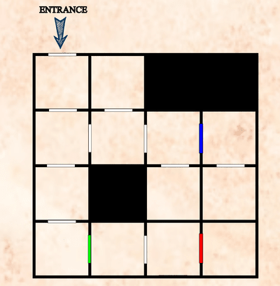

# SoftwareEngineeringProject-Text Based Game :european_castle:

Gruppo 9 (Simionato Matteo, Pizzolato Enrico, Piccolo Stefano, Dall'Ò Leonardo)
                                                                                                    
                                                           
                              #--------===#                                  
                           =-::::-+++**++==-=+#                              
                         *----++--===========+++*#                           
                       %===**=-==**##%@%#*****#*##%                          
                      *+**=-*@#*+#@@@@@@@@@@%***##%                          
                    *=----=#@@%**@@@@@@@@@@@%***#%                           
                 *++*****++%@@@%#@@@@@@@@@@#*###                             
               +----====--*@@@@@#@@@@@@@@@@*#                                
              #=------=+*#%###%@+@@@@@@@@@@##    %%%#*+=-==+++***            
             **#*****====+%*++++++++++#@@@@@#***##+++=*#*+========*          
          #*=-============+++++*=+*======+%@@%##%****##============+*        
      %+=-=*=----=======+===+=======-=========+*#*#*##***+*******##*++=+*#%  
     *----+**+==++***++=====================+*****%  #++*##===============*% 
    %*=-----================++++++===+++++++***##%        #=--=========-==*@ 
    **#*++++**###**++===+**+++++++*++++=+#%%%##**%         %++#  ###%+=---+  
    *=+**++++***++++++****+**##*********#**********##                 *==*  
    #===+*#**##******##***#**********************#%#*=%                         
    ##**=---=++*#***********######*****#####*###**##%                          
     *=--=======#**********#***+========++*****#                              
      #+*#%%++++   @%%%           %#++====+*%                                 
                                                                                                   
                                                                                
                                                                      

## Documentazione e istruzioni per l'utilizzo
Tutta la documentazione è consultabile sul branch [docs](https://github.com/TeoSimii/SoftwareEngineeringProject/tree/docs)

## Introduzione al gioco
Il nostro progetto è un fantasy text-based game ambientato in un dungeon, dove i giocatori navigano attraverso stanze per raccogliere oggetti e strumenti da utilizzare in battaglia. Questi oggetti aiutano ad avanzare nell'avventura aumentando le statistiche del giocatore o venendo scambiati con gli NPC per ottenere oggetti chiave. Il gioco si vince sconfiggendo il boss finale situato nell'ultima stanza del dungeon. Al contrario, il gioco termina se i Punti Salute (HP) del giocatore scendono a zero durante un combattimento. Per evitare ciò, i giocatori possono trovare oggetti curativi in varie stanze per ripristinare parzialmente i loro HP.

Il giocatore inizia nella stanza in alto a sinistra della griglia del dungeon, con l'obiettivo di raggiungere la stanza del boss. Lungo il percorso, deve evitare di perdere HP e trovare oggetti chiave per superare porte bloccate. Progettato come un gioco basato su testo, permette ai giocatori di richiedere aiuto in qualsiasi momento utilizzando il comando "help", che fornisce un elenco di comandi come "inventory", "list" (per visualizzare oggetti e NPC nella stanza) e "save". Il comando "save" è particolarmente importante poiché consente ai giocatori di salvare i progressi del gioco corrente nei bucket AWS, permettendo loro di uscire e successivamente riprendere l'avventura dall'ultimo punto di salvataggio.

Il layout della griglia, comprese le porte bloccate, gli oggetti e gli NPC, è dettagliato nel file "CompleteDungeon.png" nella cartella img. Qui sotto è presente una griglia spoglia del dungeon:

## Per l'utilizzo
Il progetto va aperto sull'IDE Intellij e caricato con Maven. 

Questo è necessario per l'utilizzo del file "pom.xml" che contiene gli script per le dipendenze, vitali per usare diverse librerie che verranno spiegate più avanti. A questo punto, selezionando il file Main.java, sarai in grado di eseguire il programma con il pulsante verde nella sezione superiore e l'interfaccia grafica del gioco apparirà: ora puoi inserire i comandi nella barra di testo in basso e inviarli con il pulsante. Buona partita!

## Specifiche di versione e utilizzo di funzioni
Java è nella versione più recente 22.
Per usufruire della parte cloud che comprende il save e load della partita, si necessita del file aws-credentials.properties da posizionare nel percorso " ..\IDS-Project\src\main\resources\ ", per ottenere il file basta fare una richesta via email agli sviluppatori.

## Fonti esterne
Per la generazione delle Ascii art è stato utilizzato il sito: [AsciiArt](https://www.asciiart.eu/image-to-ascii)

Per la funzionalità di salvataggio è stato utilizzato il servizio di Amazon: [AWS S3 Bucket](https://aws.amazon.com/it/s3/)

## Librerie utilizzate
Le librerie esterne utilizzate nel progetto sono:
* java swing
* java awt
* com.google.gson
* java.nio
* .lang.Thread
* .org.json
* .org.apache.commons.io
