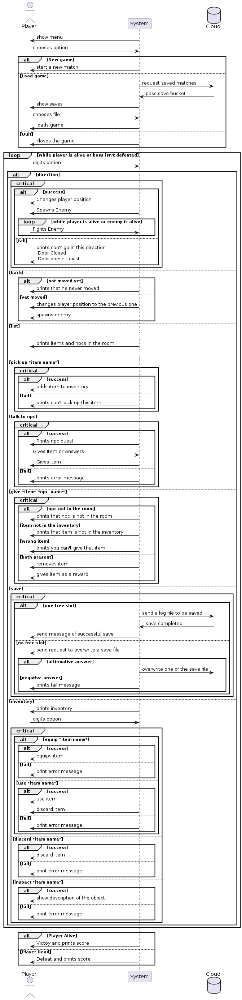

# System Diagram

''''plantuml
@startuml
actor Player
participant System
database Cloud
System -> Player: show menu
Player -> System: chooses option
alt New game
  System -> Player: start a new match
else Load game
  System -> Cloud: request saved matches
  Cloud -> System: pass save bucket
  System -> Player: show saves
  Player -> System: chooses file
  System -> Player: loads game
else Quit
  System -> Player: closes the game
end

loop while player is alive or boss isn't defeated
Player->System: digits option

alt direction
critical
alt success

System -> Player: Changes player position
System->Player: Spawns Enemy

loop while player is alive or enemy is alive
Player->System: Fights Enemy

end

else fail
System -> Player: prints can't go in this direction\n Door Closed\n Door doesn't exist

end
end 

else back
alt not moved yet
System -> Player: prints that he never moved
else yet moved
System->Player: changes player position to the previous one
System->Player: spawns enemy
end

else list
...
System -> Player: prints items and npcs in the room
...
else pick up *item name*

critical
alt success
System -> Player: adds item to inventory

else fail
System -> Player: prints can't pick up this item

end
end

else talk to npc
critical
alt success
System -> Player: Prints npc quest
Player -> System: Gives Item or Answers
System -> Player: Gives Item
else fail
System -> Player: prints error message

end
end

else give *item* *npc_name*
critical
alt npc not in the room
System -> Player: prints that npc is not in the room
else item not in the inventory
System -> Player: prints that item is not in the inventory
else wrong item
System -> Player: prints you can't give that item
else both present
System->Player: removes item
System -> Player: gives item as a reward
end
end

else save
critical
alt one free slot 
System->Cloud: send a log file to be saved
Cloud->System: save completed
System->Player: send message of successful save
else no free slot
System->Player: send request to overwrite a save file
alt affirmative answer
System->Cloud: overwrite one of the save file
else negative answer
System->Player: prints fail message
end
end
end

else inventory
System->Player: prints inventory
Player->System: digits option
critical
alt equip *item name*
alt success
System->Player: equips item
else fail
System->Player: print error message
end

else use *item name*
alt success
System->Player: use item
System->Player: discard item
else fail
System->Player: print error message
end
end

else discard *item name*
alt success
System->Player: discard item
else fail
System->Player: print error message
end

else inspect *item name*
alt success
System->Player: show description of the object
else fail
System->Player: print error message
end
end

end
end

alt Player Alive
System->Player: Victoy and prints score
else Player Dead
System->Player:Defeat and prints score
end
@enduml
''''
